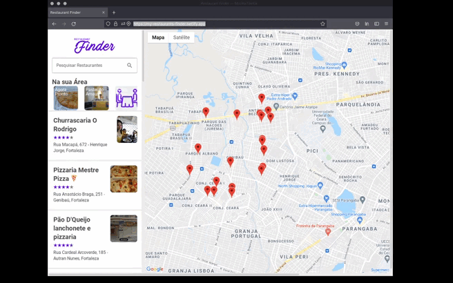
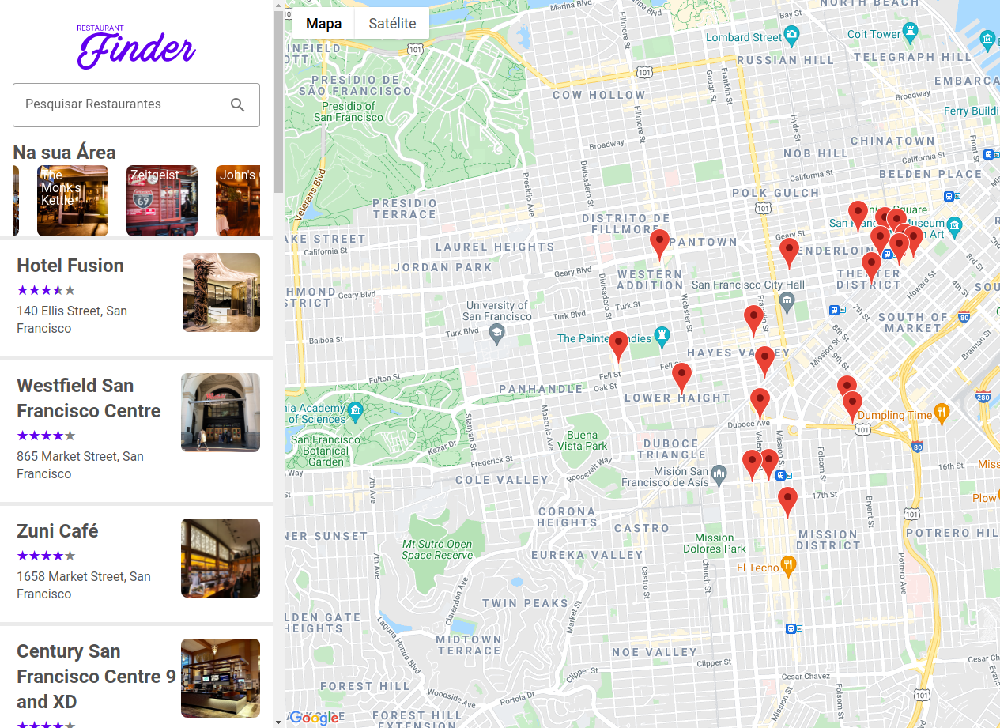

<p align="center">
  

  

  
</p>

<br>

# Restaurant Finder

<h2 align="center">
  
</h2>

Nesse projeto foi construído junto com o especialista [Patrick Narciso](https://www.linkedin.com/in/patricknarciso/). Trata-se de um sistema web de busca de restaurantes, parecido com o serviço que o Google oferece.
Restaurants Finder é um buscador usando React.JS e API do Google.

<br>

## Autor

- [Alexandre Santos](https://github.com/alexandresantosm)

<br>

## Logo

<h2 align="center">
  
</h2>

<br>

## Executar Localmente

Clone o projeto

```bash
  git clone https://github.com/alexandresantosm/restaurants-search.git
```

Abra o diretório do projeto

```bash
  cd restaurants-search
```

Instale as dependências

```bash
  # Utilizando o gerenciador de pacotes npm
  npm install

  # Utilizando o gerenciador de pacotes Yarn
  yarn
```

Inicializar a aplicação

```bash
  # Utilizando o gerenciador de pacotes npm
  npm run dev

  # Utilizando o gerenciador de pacotes Yarn
  yarn dev
```

A aplicação irá inicializar no endereço `http://localhost:3000`.

<br>

## Screenshot

<h2 align="center">
  
</h2>

<br>

## Tecnologias

- **[React.js](https://pt-br.reactjs.org)**
- **[Styled-components](https://styled-components.com)**
- **[Redux](https://redux.js.org)**
- **[React Material Icons](https://www.npmjs.com/package/react-material-icons)**
- **[Google Maps React](https://www.npmjs.com/package/google-maps-react)**
- **[React Lottie](https://www.npmjs.com/package/react-lottie)**

<br>

## Agradecimentos

- **[Digital Innovation One](https://rocketseat.com.br/)**
- **[Patrick Narciso](https://www.linkedin.com/in/patricknarciso/)**

<br>

## License

Projeto sob licença MIT. Veja o arquivo **[LICENSE](LICENSE.md)** para mais detalhes.

<br>

---

<br>

Feito com 💜 by Alexandre 👋🏻.
